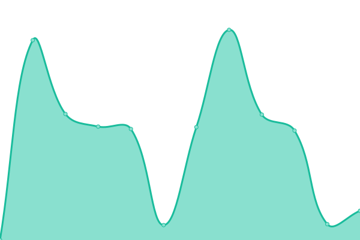
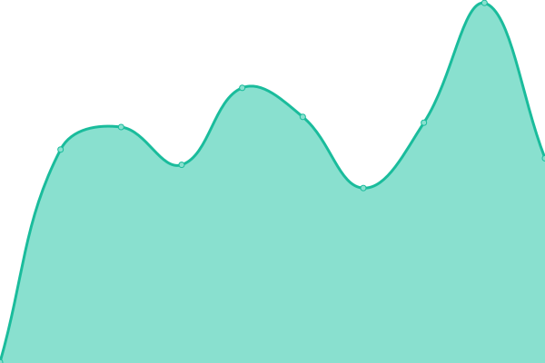
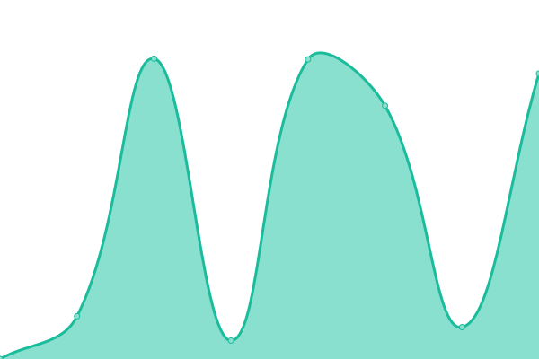

# [📈 Live Status](https://upptime.myinfra.cz): <!--live status--> **🟩 All systems operational**

This repository contains the open-source uptime monitor and status page for [Michal Hrušecký](https://michal.hrusecky.net), powered by [Upptime](https://github.com/upptime/upptime).

With [Upptime](https://upptime.js.org), you can get your own unlimited and free uptime monitor and status page, powered entirely by a GitHub repository. We use [Issues](https://github.com/miska/myinfra/issues) as incident reports, [Actions](https://github.com/miska/myinfra/actions) as uptime monitors, and [Pages](https://upptime.myinfra.cz) for the status page.

<!--start: status pages-->
<!-- This summary is generated by Upptime (https://github.com/upptime/upptime) -->
<!-- Do not edit this manually, your changes will be overwritten -->
<!-- prettier-ignore -->
| URL | Status | History | Response Time | Uptime |
| --- | ------ | ------- | ------------- | ------ |
|  [Můj Mrak webserver](https://cloud.mujmrak.cz) | 🟩 Up | [muj-mrak-webserver.yml](https://github.com/miska/myinfra/commits/HEAD/history/muj-mrak-webserver.yml) | 

 4633ms
     
 | 

<a href="https://miska.github.io/myinfra/history/muj-mrak-webserver">99.40%</a>
    

|  [Můj Mrak content](https://cloud.mujmrak.cz/s/eKHN4paXbZkJNQd/download) | 🟩 Up | [muj-mrak-content.yml](https://github.com/miska/myinfra/commits/HEAD/history/muj-mrak-content.yml) | 

 274ms
     
 | 

<a href="https://miska.github.io/myinfra/history/muj-mrak-content">99.40%</a>
    

|  [My Infra SMTP](smtp.myinfra.cz) | 🟩 Up | [my-infra-smtp.yml](https://github.com/miska/myinfra/commits/HEAD/history/my-infra-smtp.yml) | 

 896ms
     
 | 

<a href="https://miska.github.io/myinfra/history/my-infra-smtp">100.00%</a>
    

|  [My Infra SMTPS](smtp.myinfra.cz) | 🟩 Up | [my-infra-smtps.yml](https://github.com/miska/myinfra/commits/HEAD/history/my-infra-smtps.yml) | 

 115ms
     
 | 

<a href="https://miska.github.io/myinfra/history/my-infra-smtps">100.00%</a>
    

|  [My Infra IMAPS](imap.myinfra.cz) | 🟩 Up | [my-infra-imaps.yml](https://github.com/miska/myinfra/commits/HEAD/history/my-infra-imaps.yml) | 

 851ms
     
 | 

<a href="https://miska.github.io/myinfra/history/my-infra-imaps">100.00%</a>
    

|  [My Infra e-mails](http://status.myinfra.cz/mail_report.txt) | 🟩 Up | [my-infra-e-mails.yml](https://github.com/miska/myinfra/commits/HEAD/history/my-infra-e-mails.yml) | 

 2435ms
     
 | 

<a href="https://miska.github.io/myinfra/history/my-infra-e-mails">100.00%</a>
    

<!--end: status pages-->

[**Visit our status website →**](https://upptime.myinfra.cz)

## 📄 License

- Powered by: [Upptime](https://github.com/upptime/upptime)
- Code: [MIT](./LICENSE) © [Michal Hrušecký](https://michal.hrusecky.net)
- Data in the `./history` directory: [Open Database License](https://opendatacommons.org/licenses/odbl/1-0/)
